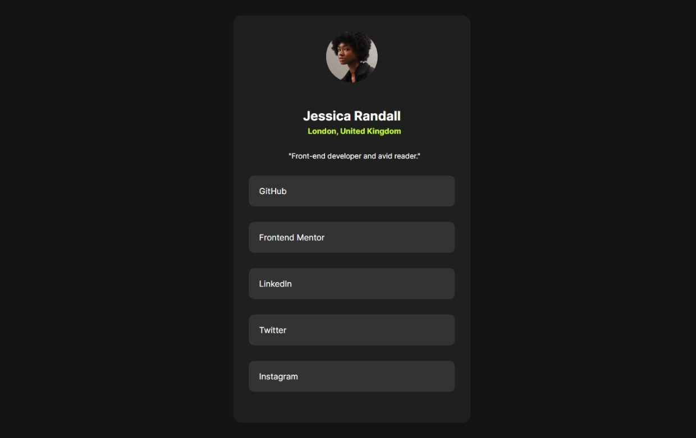

# Social Links Profile

This project is a profile card showcasing a user's social links and basic information.

## Preview



**Name:** Jessica Randall  
**Location:** London, United Kingdom  
**Bio:** "Front-end developer and avid reader."

## Social Links

- [GitHub](#)
- [Frontend Mentor](#)
- [LinkedIn](#)
- [Twitter](#)
- [Instagram](#)

## Project Details

The project includes:

- A profile card with a circular avatar.
- A heading with the user's name.
- A location and bio.
- A list of social media links with hover effects.

## Technologies Used

- HTML
- CSS
- Font: [Inter](https://rsms.me/inter/)

## Setup

To view the project locally, clone the repository and open `index.html` in your browser. Ensure the assets are in the correct paths for proper rendering.

```sh
git clone https://github.com/waeldrwish/social-links-profile-main.git
cd social-links-profile-main